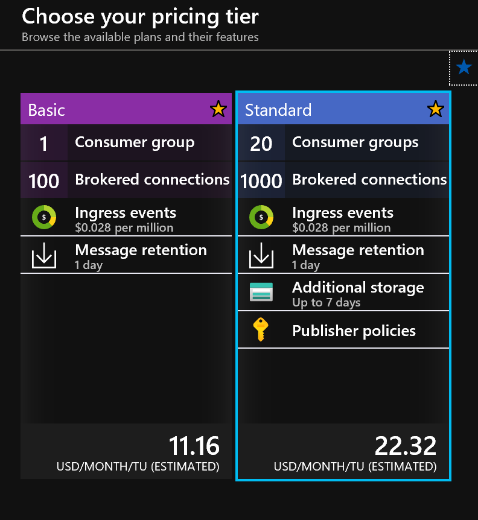
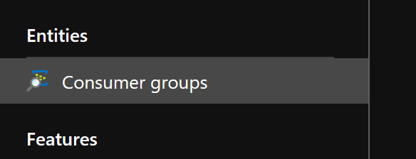

# Hackathon Prerequisites 

The following resources are implemended during the hackathon, please ensure you can create in your subscription or resource group:

- Azure Storage Account - Blob 
- Azure Event Hubs
- Azure Stream Analytics
- Azure Logic Apps
- Azure Service Bus
- Azure SQL Database
- Azure Cloud Shell

_A [Twillio](https://www.twilio.com/) account is used in this tutorial to send SMS text for alerting._

## Using Cloud Shell

The following bach commands will be ran using the [Azure Cloud Shell](https://docs.microsoft.com/en-us/azure/cloud-shell/overview). 

Launch from Azure portal using the Cloud Shell icon


Select __Bash__


## Setting-Up

The following will need to be completed before proceeding to step 1

## Azure Portal

Azure subscription. If you don't have one, create a [free account](https://azure.microsoft.com/en-us/free/) before you begin.

## Create a Resource Group for the Hack

A resource group is a logical collection of Azure resources. All resources are deployed and managed in a resource group. To create a resource group:

### Resource Group - Use Azure CLI

```bash
resourceGroupName=hackathon-$RANDOM
location = SouthCentralUS

az group create \
   --name $resourceGroupName \
   --location $location \
```

### Resource Group - Use Azure Portal
[Create Resource Group](https://docs.microsoft.com/en-us/azure/event-hubs/event-hubs-create#create-a-resource-group)

## Create and Azure Storage Account

An Azure storage account contains all of your Azure Storage data objects: blobs, files, queues, tables, and disks. Data in your Azure storage account is durable and highly available, secure, and massively scalable. We will use a storage account for our cold path storage and to store alert records.

### Storage - Use Azure CLI

```bash
accountName=hackathon-$RANDON

az storage account create \
    --name $accountName \
    --resource-group $resourceGroupName \
    --location $location \
    --sku Standard_LRS \
    --kind StorageV2

```

Create two containers: __coldstore__ and __streamalerts__.

```bash
export AZURE_STORAGE_ACCOUNT="<storage account>"
export AZURE_STORAGE_KEY="<sas key>"

az storage container create --name coldstore

az storage container create --name streamalerts
```

### Storage - Use Azure Portal

[Create Azure Storage Account](https://docs.microsoft.com/en-us/azure/storage/common/storage-account-create?tabs=azure-portal)

Create two containers using the portal: __coldstore__ and __streamalerts__.

## Azure Event Hubs

Azure Event Hubs will be the architecural component for our streaming ingest. 

### [Create an Event Hubs Namespace](https://docs.microsoft.com/en-us/azure/event-hubs/event-hubs-create#create-an-event-hubs-namespace)

We will be using the Standard pricing tier to demonstrate the use of multiple [consumer groups](https://docs.microsoft.com/en-us/azure/event-hubs/event-hubs-features#consumer-groups).

 

An Event Hubs namespace provides a unique scoping container, referenced by its fully qualified domain name, in which you create one or more event hubs.

An __Event Hubs namespace__ provides a unique scoping container, referenced by its fully qualified domain name, in which you create one or more event hubs or Kafka topics.

### [Create and Event Hub](https://docs.microsoft.com/en-us/azure/event-hubs/event-hubs-create#create-an-event-hub)

__Azure Event Hubs__ is a scalable event processing service that ingests and processes large volumes of events and data, with low latency and high reliability.

#### Add Consumer Groups

After createing the Event Hub we will want to add two consumer groups, one for the hot path and one for the cold path:

Go to Consumer Groups



Add the hot and cold consumer groups


Once you are complete with the prereqs, move on to [Step 1](../01-DataLoad/) if you will be creating a stream with the provided 'mock' data or jump to [Step 2](../02-StreamHot) if loading your own data.
