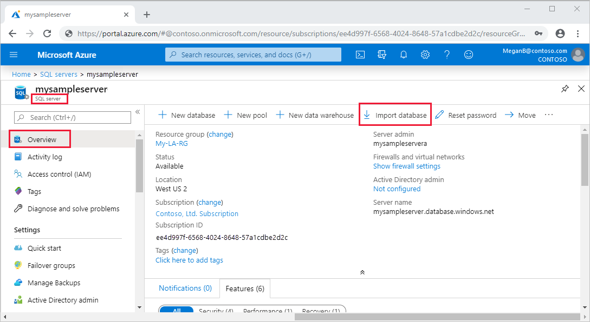
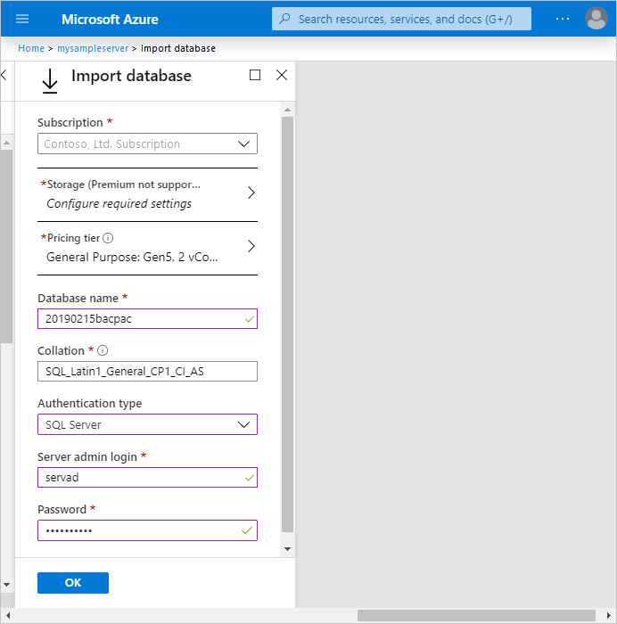
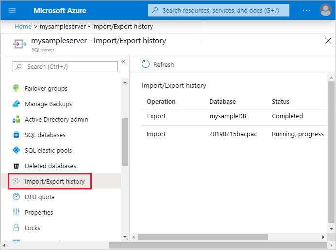
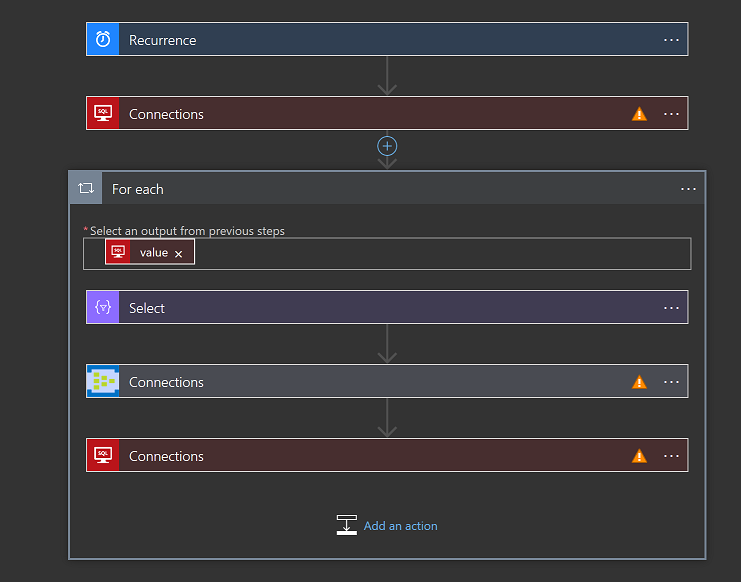
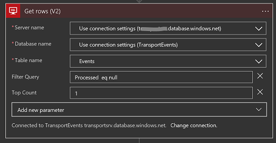
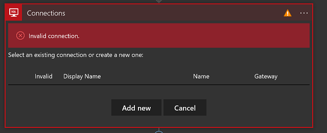
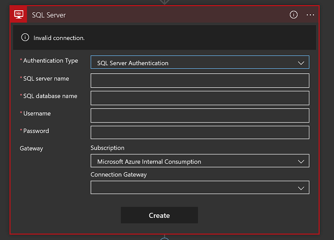
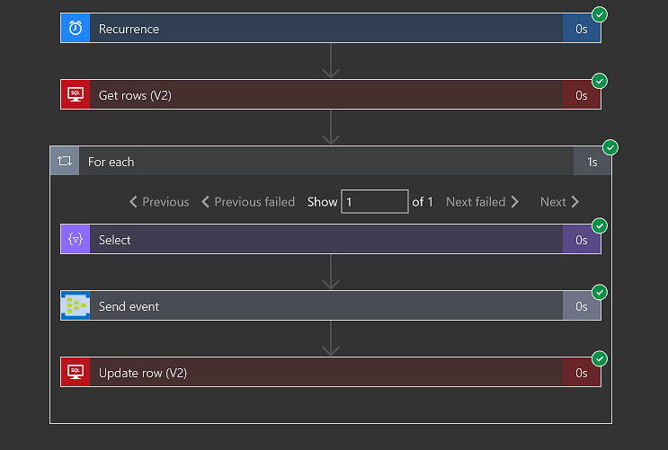

# Load data for stream reference and to simulate stream

Please use this guide to load the driver data and the Logic App to simulate a stream.


## Loading Data into Azure SQL DB

### Create an Azure SQL Server

Run the following Azure CLI using Cloud Shell to quickly create an Azure SQL Server

```

resourceGroupName=
location=SouthCentralUS
adminLogin=
password=
serverName=hackathon-$RANDOM
databaseName=hackathon


# The ip address range that you want to allow to access your DB. 
# Leaving at 0.0.0.0 will prevent outside-of-azure connections to your DB
startip=0.0.0.0
endip=0.0.0.0


# Create a logical server in the resource group
echo "Creating primary logical server..."
az sql server create \
   --name $serverName \
   --resource-group $resourceGroupName \
   --location $location  \
   --admin-user $adminLogin \
   --admin-password $password

# Configure a firewall rule for the server
echo "Configuring firewall..."
az sql server firewall-rule create \
   --resource-group $resourceGroupName \
   --server $serverName \
   -n AllowYourIp \
   --start-ip-address $startip \
   --end-ip-address $endip


```

### Import BACPAC to create Database

Once your Azure SQL Server is created you can quickly create a database using the Driver and Event data by importing a BACPAC file.

__Copy BACPAC file to Storage Account__

```
export AZURE_STORAGE_ACCOUNT="<storage account>"
export AZURE_STORAGE_KEY="<sas key>"
container=bacpac

az storage container create --name $container

git clone https://github.com/Jscholtes128/Azure-Streaming-Hackathon.git


az storage blob upload \
    --container-name $container \
    --name TransportEvents-Hack_1_14.bacpac\
    --file 'Azure-Streaming-Hackathon/Steps/01-DataLoad/dependencies/TransportEvents-Hack_1_14.bacpac'
```

__Import BACPAC__

1. To import from a BACPAC file into a new single database using the Azure portal, open the appropriate database server page and then, on the toolbar, select Import database.



2. Select the storage account and the container for the BACPAC file and then select the BACPAC file from which to import.

3. Specify the new database size (usually the same as origin) and provide the destination SQL Server credentials. For a list of possible values for a new Azure SQL database, see Create Database.



4. Click OK.

5. To monitor an import's progress, open the database's server page, and, under Settings, select Import/Export history. When successful, the import has a Completed status.



5. To verify the database is live on the database server, select SQL databases and verify the new database is Online.

_[Import BACPAC](https://docs.microsoft.com/en-us/azure/sql-database/sql-database-import?tabs=azure-powershell) into a Azure SQL Database_


### Use Azure Logic Apps to Simulate Stream

Open the Azure Cloud Shell to Bash and run

```
resourceGroupName='<set>'
name='EventCreateLogicApp'
templatefile='Azure-Streaming-Hackathon/Steps/01-DataLoad/dependencies/template.json'

git clone https://github.com/Jscholtes128/Azure-Streaming-Hackathon.git

az group deployment create \
  --name $name\
  --resource-group $resourceGroupName \
  --template-file $templatefile 
```

Once the Azure Logic App is created, we will need to manually resolve the missing SQL and Event Hub connections.



We will have to add new SQL and Event Hub Connections by clicking the connection error then selecting change connection.



Select __Add New__



The enter the connection properties.



Complete these steps for the remaining connection errors to start the Logic App.



Once you are complete with this step, move on to [Step 2](../02-StreamHot/)